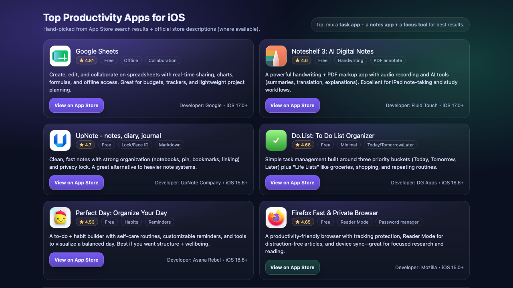

# 📱 Intelligent Apps Recommender

An AI-powered application recommendation system that intelligently searches and recommends apps from the **Apple App Store** and **Google Play Store** for iOS and Android devices.

## ✨ Features

- **Intelligent App Search**: Uses AI to understand user queries and find the most relevant apps
- **Dual-Platform Support**: Recommends apps from both Apple App Store (iOS) and Google Play Store (Android)
- **Rich App Details**: Retrieves comprehensive app information including ratings, developer details, descriptions, and app icons
- **Beautiful HTML Output**: Generates visually appealing HTML reports with embedded CSS styling
- **Powered by Claude AI**: Uses OpenAI's GPT models for intelligent recommendation logic
- **SerpAPI Integration**: Leverages SerpAPI for accurate app search results

## 🚀 Quick Start

### Prerequisites

- Python 3.13+
- Poetry (dependency management)
- API Keys:
  - OpenAI API Key (for GPT model access)
  - SerpAPI Key (for app store searches)

### Installation

1. Clone the repository:
```bash
git clone <repository-url>
cd google-store-ai-agent
```

2. Install dependencies using Poetry:
```bash
poetry install
```

3. Create a `.env` file in the root directory with your API keys:
```
SERP_BASE_URL=https://serpapi.com
SERP_API_KEY=your_serp_api_key_here
OPENAI_API_KEY=your_openai_api_key_here
```

### Usage

Run the app recommender with a natural language query:

```bash
python -m google_store_ai_agent.app "productivity apps for ios"
```

```bash
python -m google_store_ai_agent.app "best gaming apps android"
```

```bash
python -m google_store_ai_agent.app "photo editing apps"
```

The agent will:
1. Search the app stores based on your query
2. Analyze and retrieve app details (ratings, descriptions, icons)
3. Generate a beautiful HTML report with the best recommendations
4. Display results in your terminal

## 📸 Demo

### Productivity Apps for iOS
Get curated recommendations with detailed app information, ratings, and one-click App Store links.




## 📁 Project Structure

```
google-store-ai-agent/
├── google_store_ai_agent/
│   ├── app.py                          # Entry point for the application
│   ├── agents/
│   │   └── google_store_ai_agent.py   # Main AI agent for recommendations
│   ├── tools/
│   │   └── serp_tool.py               # Tools for app store search & HTML generation
│   ├── services/
│   │   ├── serp_service.py            # SerpAPI integration
│   │   └── base_http_client.py        # HTTP client for API calls
│   └── prompts/
│       └── google_store_prompts.py    # System prompts for the AI agent
├── tests/                             # Test suite
├── pyproject.toml                     # Poetry configuration
├── poetry.lock                        # Locked dependency versions
├── .env                               # Environment variables (not in version control)
└── README.md                          # This file
```

## 🔧 How It Works

### Architecture

The system uses a **pydantic-ai Agent** that orchestrates the recommendation process:

1. **Query Input**: User provides a search query
2. **Agent Processing**: The AI agent breaks down the query and determines the best platform (iOS/Android/Both)
3. **App Search**: Uses `getPlayStoreApps` (Android) or `getAppleStoreApps` (iOS) tools to search for matching apps
4. **Details Retrieval**: Fetches detailed information about each app using product IDs
5. **HTML Generation**: Uses the `createHTML` tool to format results in a beautiful, responsive HTML page
6. **Output**: Returns the HTML file with styled app recommendations

### Available Tools

The AI agent has access to the following tools:

- **getPlayStoreApps**: Search for apps on Google Play Store
- **getAppleStoreApps**: Search for apps on Apple App Store
- **getProductDescriptionForPlayStoreApp**: Get detailed app information from Play Store
- **getProductStoreDescriptionForAppleStoreApp**: Get detailed app information from App Store
- **createHTML**: Generate beautiful HTML reports with the recommendation results

## 📊 Output Features

The generator creates responsive HTML pages with:

**Visual Design:**
- 🎨 Beautiful dark theme with gradient backgrounds (purple → teal)
- 📱 Mobile-responsive grid layout (2-column desktop, 1-column mobile)
- ✨ Smooth hover effects and transitions

**App Information:**
- 🎯 App icons and logos from official app stores
- ⭐ User ratings and review counts
- 👨‍💻 Developer information and requirements (iOS/Android versions)
- 📝 Full app descriptions and features
- 🏷️ Categorized tags (Free, Paid, Features, etc.)
- 🎮 Special indicators (Game Center, Multiplayer, etc.)

**Interactions:**
- 🔗 Direct clickable links to App Store / Play Store
- 🌐 Developer website links (when available)
- 💡 AI-generated tips for better search results
- 📋 Sorting indicators (by price, popularity, etc.)

## 🔑 Environment Variables

Create a `.env` file with:

```
SERP_BASE_URL=https://serpapi.com          # SerpAPI base URL
SERP_API_KEY=your_api_key                  # SerpAPI key for app searches
OPENAI_API_KEY=your_openai_key             # OpenAI API key for GPT models
```

## 📦 Dependencies

- **pydantic-ai**: AI framework for building intelligent agents
- **python-dotenv**: Environment variable management
- **requests**: HTTP client for API calls

See `pyproject.toml` for complete dependency list.

## 💡 Use Cases

- Find the best productivity apps for specific devices
- Discover top-rated games in different categories
- Compare app options across platforms
- Generate curated app lists for specific purposes
- Research app trends and popular applications

## 🧪 Testing

Run the test suite:

```bash
pytest tests/
```

## 📝 Notes

- Queries should be concise and descriptive (e.g., "note-taking apps", "weather apps", "fitness trackers")
- The agent works best with single keyword searches for more accurate results
- Generated HTML files are automatically saved in the project root
- All app links open in the respective app stores

## 🔐 Security

- Never commit your `.env` file to version control
- Keep your API keys secure and rotate them periodically
- The `.gitignore` file is configured to exclude sensitive files

## 🤝 Contributing

Contributions are welcome! Feel free to:
- Report bugs or issues
- Suggest new features
- Improve documentation
- Submit pull requests

## 📄 License

This project is licensed under the terms specified in the repository.

## 🎯 Future Enhancements

- Support for additional app stores (Samsung Galaxy Store, etc.)
- Advanced filtering by app category, rating, and price
- App comparison features
- Trending apps section
- User preference learning
- Integration with app review aggregators

---

**Built with ❤️ using pydantic-ai**
